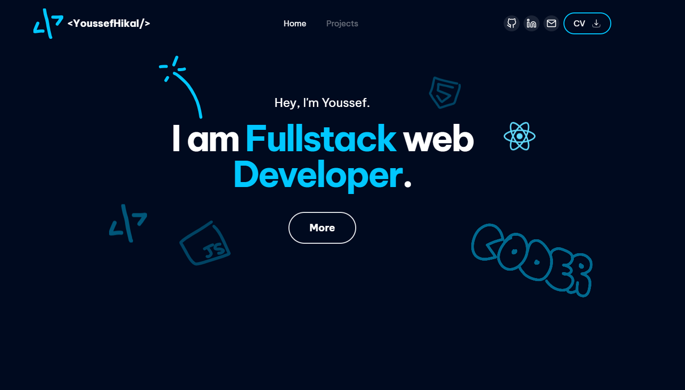

### [Youssef Hikal 🌐](https://youssefhikal.vercel.app/)

Language and Tools</h3>

   
    
   
   
  
   
   
  
    
   
   
  
    
  
   
  
   
  
  
   
  
   
   
   
   
  
  
   
   
   
  

### 📊 Top Languages

 
